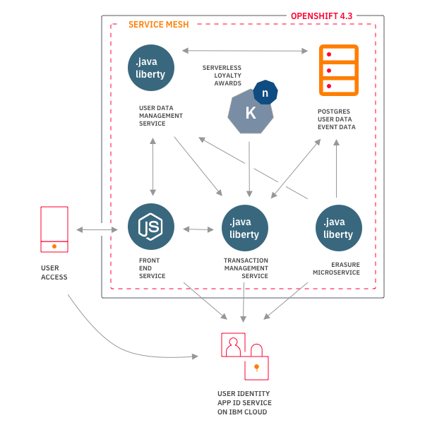

# Building a data privacy focused mobile back-end

In this pattern, we show how to deploy a microservice based back-end in OpenShift 4.3. To simulate a series of mobile views, we deploy a Node.js based service. 

## Introduction

As people become more aware of data and concerned about their online privacy, regulations around the world have started requiring software projects to think about how customers' data is handled.  This pattern deploys a set of microservices to act as a back-end for a mobile loyalty app, such as those often used by businesses who want to better understand how people use their services by collecting data. Although inspired by regulations such GDPR (Europe's general data protection regulations), as this is not a real public facing application, we implement a few data privacy features as a way of demonstrating how one might go about building a privacy focused back-end in OpenShift 4.

The GDPR standard defines requirements around what operations need to be available to users ("subjects"). However, GDPR is technology neutral, so it ends up being the responsibility of the implementors to build the architecture that implements the requirements. In addition, with the move toward microservice architectures and containerization, we have technology such as service mesh that may be useful in the context of a data privacy service.

## Included Components

- [IBM Managed OpenShift](https://www.ibm.com/cloud/openshift)
- [OpenLiberty](https://openliberty.io)
- [App ID](https://www.ibm.com/cloud/app-id)
- [LogDNA](https://www.ibm.com/cloud/log-analysis)

# Prerequisites

1. Log in, or create an cccount on [IBM Cloud](https://cloud.ibm.com)
2. Provision an OpenShift 4.3 cluster on on [IBM Cloud](https://cloud.ibm.com/docs/openshift?topic=openshift-openshift_tutorial)
3. Create a [project](https://docs.openshift.com/container-platform/4.3/applications/projects/configuring-project-creation.html) called `example-loyalty`.

## Why OpenShift?

OpenShift is RedHat's customized distribution of Kubernetes. With OpenShift, you get everything that you know and love about Kubernetes, with a few extra features, such as OperatorHub, for finding and installing new in-cluster services, a convenient CLI for navigating between different projects. For a quick look into new features, see: [Intro to OpenShift 4](https://developer.ibm.com/articles/intro-to-openshift-4/).

## Project Requirements

In this pattern, we will be looking to build a hypothetical customer loyalty back-end for an organization that wants to encourage developers to attend events and workshops by allowing them to earn points that can be redeemed for freebies like T-shirts, keychains, and hats.

Customer loyalty programs are common for businesses that want to incentivize customers to "check-in" frequently, allowing businesses to provide services closely matched to user behavior and demand. As regulations come online, users typically have the ability to opt-out of data collection efforts. In addition, users want the ability to delete data.

We have implemented a few important data privacy features inspired by real data privacy regulations:

* Authorization verification with IBM App ID
* Right to erasure: implemented via a special Kubernetes `CronJob` that checks for deletion requests every 24h.
* Consent for data collection - requiring users to 'opt-in' requirement.
* Logging: IBM LogDNA is used to aggregate log data from back-end services, making it possible to review user activity as well as monitor usage.

# Architecture

The loyalty system includes several microservices for handling user authentication and transacton mechanics.



## Introduction to the Mobile Simulator

The JavaScript simulator app presents a view of a mobile app but run by a Node.js service that gets deployed to the OpenShift project along with the other services.


From the dropdown menu inside the simulated phone app, pick one of the available accounts, and click **sign in** to see that user's point accumulation.


This is the user screen, indicated by the button at the bottom left.  Click on the button all the way to the right to register for an upcomming event:


Once an event has been added to a user's list of reservations, they can then check in from list of upcoming events that is displayed by clicking on the middle button:


## User authentication


1. The user creates an account using the mobile app simulator. This hits an API from the nodejs server. The nodejs server then hits an API from the App ID service that would create the user's account in its own cloud directory.
2. The mobile app simulator then logs in the user after account creation. The App ID service then creates valid access tokens and ID tokens for the user. The mobile app stores these tokens for later use in authentication.
3. Using the access token from the previous step, the mobile app can now successfully call the protected APIs in the Liberty microservice. The mobile app calls the API with the access token in the authorization header to create the user profile in the database.
4. The Liberty service is integrated with the App ID instance. This verifies the access token in the authorization header from the request.
5. When the token is valid, the user profile is created in the database. The access token contains the user ID of the user that sent the request.


- Auth token flow with AppId as identity provider and Liberty's use of token to
  authenticate users:

The Liberty microservices are protected APIs that require authorization headers. If the request does not have one, it will not allow the request to be processed, thus sending a 401 Unauthorized response. The microservices makes use of a managed identity provider, App ID for this authentication. This makes it easier to protect APIs and manage identity information of users.

The mobile app simulator is integrated with the App ID instance and whenever a user logs in, the app receives access tokens and stores them for later use in requests to the protected APIs. The tokens expire in an hour by default which would require users to authenticate again after expiration.

Whenever a request with a token in the authorization header is sent, the Liberty microservice uses the App ID integration to make sure that the token is valid. Then it continues to process the request. The liberty microservice also makes use of the subject ID or user ID in the token to identify which user is making the request. For example, when a user asks for his number of points earned, it needs to pull the right profile from the database. This is where the user ID in the token payload can be made use of.

## Deployment

There two options for deploymen: an automated deployment process driven by Tekton pipelines, and a manual process driven by CLI. In either case, the following common steps should be completed first:

1. Create an OpenShift 4.3 cluster.
2. Complete the PostgreSQL database deployment process (see below).
3. Follow the App ID configuration below.
4. Set up the required Kubernetes secrets for each service.

### Automated deployment

The steps to use the Tekton pipelines - [here.](https://developer.ibm.com/tutorials/tekton-pipeline-deploy-a-mobile-app-backend-openshift-4/)

### App ID Configuration

Create an [App ID](https://cloud.ibm.com/catalog/services/app-id) instance. Once created, do the following to configure the instance for this pattern.

* Allow Sign-up and Sign-in using username and password by going to the tab `Cloud Directory` > `Settings`


* Disable Email Verification by going to the tab `Cloud Directory` > `Email Templates` > `Email verification`


* Add an application in the `Applications` tab. Take note of the `clientId`, `secret`, `oAuthServerUrl` and place them in the `.env.template` file of this repo. The values belong in `APP_ID_CLIENT_ID`, `APP_ID_CLIENT_SECRET`, `APP_ID_TOKEN_URL` respectively.


* Create Service credenitals with the `Writer` Role so that the simulator can create simulated users with the App ID instance. Take note of the `apikey` and `managementUrl` and place them in the `.env.template` file. The values belong in `APP_ID_IAM_APIKEY` and `APP_ID_MANAGEMENT_URL` respectively.


* Rename `.env.template` file to `.env` file

## Secrets from App ID

Open the credentials screen to view the client IDs and keys needed for the back-end to interact with the App ID via its REST API endpoint.

The service credentials have the following fields - some of these are used in the `loyalty-oidc-secret` as described below:
```
{
  "apikey": "APIKEY",
  "appidServiceEndpoint": "https://us-south.appid.cloud.ibm.com",
  "clientId": "CLIENTID",
  "discoveryEndpoint": "https://us-south.appid.cloud.ibm.com/oauth/v4/3d17f53d-4600-4f32-bb2c-207f4e2f6060/.well-known/openid-configuration",
  "iam_apikey_description": "Auto-generated for key <uuid>",
  "iam_apikey_name": "write-credentials-for-creating-users",
  "iam_role_crn": "crn:v1:bluemix:public:iam::::serviceRole:Writer",
  "iam_serviceid_crn": "CRN",
  "managementUrl": "https://us-south.appid.cloud.ibm.com/management/v4/3d17f53d-4600-4f32-bb2c-207f4e2f6060",
  "oauthServerUrl": "https://us-south.appid.cloud.ibm.com/oauth/v4/3d17f53d-4600-4f32-bb2c-207f4e2f6060",
  "profilesUrl": "https://us-south.appid.cloud.ibm.com",
  "secret": "SECRET_STRING",
  "tenantId": "TENANTID_STRING",
  "version": 4
}
```

Map these fields into the secret as follows: 

OIDC_JWKENDPOINT: oathServerUrl/publickeys

OIDC_ISSUERIDENTIFIER: oathServerUrl

OIDC_AUDIENCES: client ID of the application - see above.


```
kubectl create secret generic loyalty-oidc-secret --from-literal=OIDC_JWKENDPOINTURL=https://us-south.appid.cloud.ibm.com/oauth/v4/3d17f53d-4600-4f32-bb2c-207f4e2f6060/publickeys --from-literal=OIDC_ISSUERIDENTIFIER=https://us-south.appid.cloud.ibm.com/oauth/v4/3d17f53d-4600-4f32-bb2c-207f4e2f6060 --from-literal=OIDC_AUDIENCES=<client ID>
```

## Database setup

The data in the loyalty example app lives in a PostgreSQL database. 

#### Loyalty Database design

The database schema allows us to manage user profiles and track their attendence at events.


In this pattern, the database is created in an database instance created inside the OpenShift cluster. See [operator tutorial](https://developer.ibm.com/tutorials/operator-hub-openshift-4-operators-ibm-cloud/) and database load as described below. Take note of these important elements of the database configuration:

1. Database name
2. Username
3. Password

These will be used to create a Kubernetes secret that's used by all the services in the cluster.

## Loading the data model

To load the data model, we are going to use a `Job` Kubernetes resource. This allows a task to
be run to completion to perform a task.

Follow instructions [here](https://developer.ibm.com/tutorials/operator-hub-openshift-4-operators-ibm-cloud/) to create a database in the
project where the back-end services are deployed.

After deploying the PostgreSQL database, load the SQL schema for users and event.

```
#  kubectl create secret generic loyalty-db-secret --from-literal=DB_SERVERNAME=<db_name> --from-literal=DB_PORTNUMBER=<db_port> --from-literal=DB_DATABASENAME=example --from-literal=DB_USER=<db_user> --from-literal=DB_PASSWORD=<db_password>
secret/loyalty-db-secret created
```

Verify the new secret appears in your project:

```
oc get secrets
loyalty-db-secret                     Opaque                                5         35s
```

Build and deploy the image to load the database.

```
oc apply -f job.yaml
```

You can verify the successfull deployment this way:

1. Find the Jobs run:

```
$ oc get jobs
NAME                    COMPLETIONS   DURATION   AGE
loyalty-database-load   1/1           29s        15m
```

2. Then, check the logs for the job. You will see the output of the
SQL schema loading steps from the job container.

```
$ oc logs loyalty-database-load-2xbp2
CREATE EXTENSION
CREATE DATABASE
You are now connected to database "example" as user "postgres".
CREATE SCHEMA
SET
CREATE TABLE
CREATE TABLE
CREATE TABLE
```

## Manual deployment of services

## Check out the code and build images.

### User and event management services

The user and event management services manage registered users and events using Open Liberty and JPA to handle database operations.
	
- Check out the code for all services.

```
git clone https://github.com/IBM/loyalty.git
cd loyalty-app-backend
```

1. Follow the instructions in the README.md file to build the microservices with Maven.
2. Build the images and push them to an image repository like Docker Hub that is accessible to OpenShift. 

**Note:** *If you are using the IBM Container Registry (ICR) to store images, IBM OpenShift clusters are provisioned with a image pull secret for ICR images only in the default namespace/project.  Deployments to other prjects from ICR will require imagePullSecrets to be created.*

Modify the deployment.yaml image path to point to the image and deploy both services:

```
oc apply -f event-service/deployment.yaml -f user-service/deployment.yaml
```

Verify the services are running:

```
$ get services
NAME                               TYPE           CLUSTER-IP       EXTERNAL-IP     PORT(S)             AGE
loyalty-event-service              ClusterIP      172.21.215.251   <none>          9080/TCP            3d23h
loyalty-user-service               ClusterIP      172.21.64.7      <none>          9080/TCP            3d23h
```

### Mobile Simulator

- Verify that the `.env` file is correctly set up as described above in the App ID section. This will be used by both the node image at runtime and in creating a Kubernetes secret:

```
$ cat .env
APP_ID_IAM_APIKEY=<key>
APP_ID_MANAGEMENT_URL=https://us-south.appid.cloud.ibm.com/management/v4/<id>
APP_ID_CLIENT_ID=<client_id>
APP_ID_CLIENT_SECRET=<client_secret>
APP_ID_TOKEN_URL=https://us-south.appid.cloud.ibm.com/oauth/v4/<id>
PROXY_USER_MICROSERVICE=loyalty-user-service:9080
PROXY_EVENT_MICROSERVICE=loyalty-event-service:9080
```

This uses the .env file to create a secret used by the node process at runtime to communicate with the event and user services.

```
kubectl create secret generic mobile-simulator-secrets --from-env-file=.env
```
- Build the docker image and push to your image repository.

```
cd ..
docker build -t <repository> .
docker push <image>
```

- Modify the `deployment.yaml` image path to point to the image.

``` 
oc apply -f deployment.yaml
```


### Process Transaction - Serverless Application (Knative Serving)

This part requires the OpenShift Serverless installed in your OpenShift cluster. To install, you can follow through these instructions

- [Installing the OpenShift Serverless Operator](https://access.redhat.com/documentation/en-us/openshift_container_platform/4.3/html/serverless_applications/installing-openshift-serverless-1#serverless-install-web-console_installing-openshift-serverless)
- [Installing Knative Serving](https://access.redhat.com/documentation/en-us/openshift_container_platform/4.3/html/serverless_applications/installing-openshift-serverless-1#installing-knative-serving)

After installing Knative Serving, you can now proceed in deploying the serverless application.

This example serverless application handles the awarding of points for every transaction made. The application is only ran whenever there are new transactions.

- Build and push the image on your own repository
```
docker build -t <your-repository/image-name> loyalty-knative-service
docker push <your-repository/image-name>
```

- Modify `loyalty-knative-service/deployment.yaml` file to use the image you just built

```
# spec:
#   containers:
#     - image: <your-repository/image-name>
```

- Deploy the knative service

```
oc apply -f loyalty-knative-service/deployment.yaml
```

### Access the application

Once deployed, you can list the routes.  You should see at least one route - for the mobile simulator service, ending in `.cloud`:

```	
$ oc get routes
NAME                               HOST/PORT                                                                                                                    PATH      SERVICES                PORT      TERMINATION   WILDCARD
loyalty-mobile-simulator-service   loyalty-mobile-simulator-service-pattern.koyfman-feb10-f2c6cdc6801be85fd188b09d006f13e3-0000.us-south.containers.appdomain.cloud             loyalty-event-service   <all>                   None

```

The URL of the mobile simulator is: `loyalty-mobile-simulator-service-pattern.koyfman-feb10-f2c6cdc6801be85fd188b09d006f13e3-0000.us-south.containers.appdomain.cloud`

### Erasure service

The erasure service is a Kubernetes `CronJob` that runs daily to anonymize data for users who have made a deletion request. 

- Build and push image

```
cd loyalty-user-cleanup-utility

mvn package
docker build -t <your_repo>/loyalty-user-cleanup-utility:1.0-SNAPSHOT .
docker push <your_repo>//loyalty-user-cleanup-utility:1.0-SNAPSHOT
```

- Update the image name in the `job.yaml` file to point at the image in the repository used above.

- Create secrets for the erasure service.

The erasure service requires three secrets to communicate with the PostgreSQL database and App ID. The `loyalty-db-secret` was defined previously, as it's used by the other services. The two secrets are:

1. `loyalty-appid-secret`: This secret defines environment variables for connecting the App ID, and includes the following parameters:
```
kubectl create secret generic loyalty-appid-secret --from-literal=APPID_TENANTID=<tenant id> --from-literal=APPID_SERVICE_URL=https://us-south.appid.cloud.ibm.com
```

2. `loyalty-iam-secret`: This secret uses the IAM key to allow the service to authenticate to AppId.
```
kubectl create secret generic loyalty-iam-secret --from-literal=IAM_APIKEY=<IAM_KEY> --from-literal=IAM_SERVICE_URL=https://iam.cloud.ibm.com/identity/token
```

Here are the steps to retreive this token:

Via UI console:

On the top right menu bar, click Manage > Access (IAM).
Select IBM Cloud API Keys in the left menu bar.
Click the Create an IBM Cloud API Key button.
Provide a name and click the Create button.

CLI method is documented here: https://cloud.ibm.com/docs/iam?topic=iam-userapikey#create_user_key

2. Deploy job:

```
oc apply -f job.yaml
```

Note that the CronJob won't run immediately upon, since it's scheduled to run every 24 hours.

To run it on-demand, create a `Job` resources from the `CronJob`:

```
oc create job --from=cronjob/loyalty-user-cleanup-utility delete-now
```

When you list `jobs` you will see the completed delete-now job, as well as completed database load job. If you check the logs of the delete job, you'll see which users have been processed by the job.

```
$ oc get jobs
NAME                                      COMPLETIONS   DURATION   AGE
delete-now                                1/1           33s        45h
loyalty-database-load                     1/1           6s         3d
```

## Data cleanup

Data erasure is a two-phase operation, one synchronous and one scheduled. When an authenticated `DELETE` REST call is made for a given user, the unique ID that ties the database user entry to AppId is cleared from the local in-cluster Postgres instance. As this is the only way to connect the data the loyalty app to the real user identity (name, etc.), we've effectivly anonymized the event check-in data. The Java `User` service then flags the account as deleted, which can be useful for logging purposes.

The erasure service operates as a Kubernetes `CronJob` that checks that the user has been deleted from our database, and also removes them from App ID, effectively unregistering the user.

## LogDNA Integration

Finally, we connect our service with LogDNA to aggregate messages from the internal services.

Follow the instructions to deploy LogDNA to the OpenShift cluster here: https://cloud.ibm.com/observe/logging. 

Once deployed, your instance of LogDNA will be keeping track of any logs that are created within the application.


There can be a lot to sift through. Use one of the filters from the dropdown menus at the top of the screen to limit which logs you are viewing. For instance, you can only see logs dealing with App ID by selecting it from the **Apps** menu:


## License

This code pattern is licensed under the Apache License, Version 2. Separate third-party code objects invoked within this code pattern are licensed by their respective providers pursuant to their own separate licenses. Contributions are subject to the [Developer Certificate of Origin, Version 1.1](https://developercertificate.org/) and the [Apache License, Version 2](https://www.apache.org/licenses/LICENSE-2.0.txt).

[Apache License FAQ](https://www.apache.org/foundation/license-faq.html#WhatDoesItMEAN)

