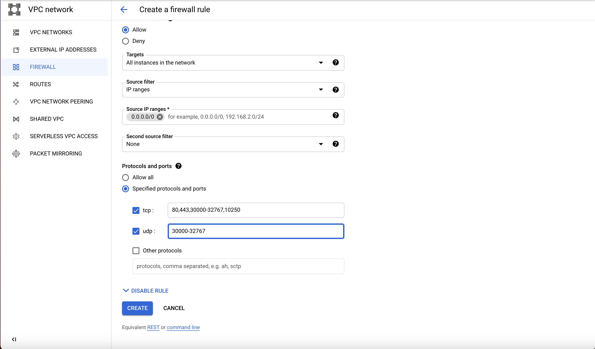
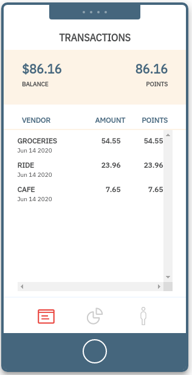
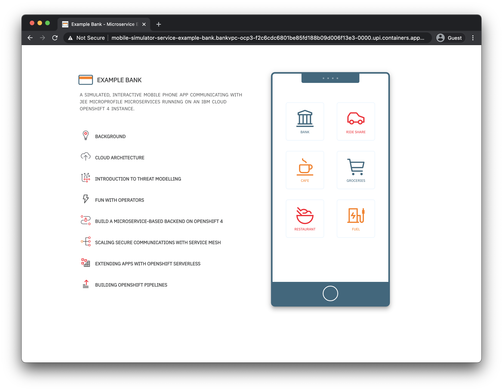

# Using IBM Cloud Satellite to run Example Bank on OpenShift in a GCP location

## Introduction to IBM Cloud Satellite

In this code pattern, we show how to deploy a microservice based back-end in OpenShift 4.3 Running on an IBM Cloud Satellite Location on virtual servers running on Google Cloud Platform. IBM Cloud Satelite allows you to connect your own compute infrastructure -- either on-premises or running in another cloud provider -- to a central control point on IBM Cloud, allowing for consistent management of OpenShift and, in the future, other services like databases. In this pattern, we'll create a Satellite location, deploy and attach VMs from Google Compute Platform, and deploy OpenShift (managed by IBM Cloud) on those virtual machines. We'll then be creating Satellite Links -- encrypted, managed tunnels -- to connect our application to services on IBM Cloud: App ID for authentication and IBM Cloud Databases for transaction storage. Finally, we'll deploying our Node.js and Java microservice-based back-end to OpenShift. The application will be running on the GCP hosts and will be made accessible via an OpenShift route.

## Introduction to Example Bank

As people become more aware of data and concerned about their online privacy, regulations around the world have started requiring software projects to think about how customers' data is handled.  This pattern deploys a set of microservices to act as a back-end for a mobile bank application, such as those often used by businesses who want to better understand how people use their services by collecting data. Although inspired by regulations such GDPR (Europe's general data protection regulations), as this is not a real public facing application, we implement a few data privacy features as a way of demonstrating how one might go about building a privacy focused back-end in OpenShift 4.

## Why OpenShift?

OpenShift is RedHat's customized distribution of Kubernetes. With OpenShift, you get everything that you know and love about Kubernetes, with a few extra features, such as OperatorHub, for finding and installing new in-cluster services, a convenient CLI for navigating between different projects. For a quick look into new features, see: [Intro to OpenShift 4](https://developer.ibm.com/articles/intro-to-openshift-4/).

## Architecture 


# Included components
- [IBM Cloud Satellite](https://www.ibm.com/cloud/satellite)
- [IBM Managed OpenShift](https://www.ibm.com/cloud/openshift)
- [OpenLiberty](https://openliberty.io)
- [App ID](https://www.ibm.com/cloud/app-id)
- [IBM Cloud Databases](https://www.ibm.com/cloud/databases-for-postgresql)

# Prerequisites

- Log in, or create an cccount on [IBM Cloud](https://cloud.ibm.com)
- Have the following tools available in your terminal:
  - Docker
  - install [ibmcloud CLI](https://cloud.ibm.com/docs/cli?topic=cli-getting-started)
  - install ['oc' OpenShift CLI](https://cloud.ibm.com/docs/openshift?topic=openshift-openshift-cli)
  - `jq` - command line JSON parser used by set-up scripts.

## Introduction to this pattern

In this code pattern, you will set up compute infrastructure on Google Cloud Platform, integrate it with IBM Cloud's managed OpenShift service, and use other services on IBM Cloud for data storage and authentication. We'll use Satellite's managed secure Link feature to connect our application on GCP with IBM Cloud. Satellite Link enables simple security and metrics of traffic flowing between locations and services on IBM Cloud.

# Steps

1. Create a Satellite location in IBM Cloud.
2. Deploy infrastructure for a Satellite location on Google Cloud by provisioning RHEL VMs from a template. [GCP Host Requirements](https://cloud.ibm.com/docs/satellite?topic=satellite-gcp)
3. Assign three GCP VMs to the Satellite Location control plane.
4. Set up a RedHat OpenShift Cluster in the satellite location.
5. Assign VMs to the OpenShift Cluster.
6. Deploy Databases for Cloud instance of PostgreSQL.
7. Deploy an App ID service.
8. Set up Satellite Links the location and cloud services.
9. Deploy Example Bank microservices and secrets.
10. Monitor traffic to the database / App ID while using Example Bank.

## Create Satellite location 

In the IBM Cloud console, follow the steps here to
create a location instance. This sets up the IBM Cloud portion that will set up the control point and networking. After naming the location, we'll be able to download the registration script, which will be saved locally. The script will be used when we create the GCP template In the next step, we'll use the script to register VM hosts with this location.

<details>
  <summary>Click to view location creation.</summary>

  

</details>
 
 ## Modify the server attachment script

 We are creating a Google Cloud virtual machine as a host for Cloud Satellite and will follow the instructions here to modify the attachment script we just downloaded: 

 https://cloud.ibm.com/docs/satellite?topic=satellite-gcp

After this line: 
`API_URL="https://containers.cloud.ibm.com/"`

We add this command to enable updates:

```
# Enable GCP RHEL package updates
yum install subscription-manager -y
```

<details>
  <summary>Modify the script.</summary>

 
</details>

## Create an instance template in GCP

Create an instance template with these parameters for a 4 vCPU and 16GB of memory. In the Boot disk section, select Red Hat Enterprise Linux 7 with a 100GB disk.

 

Select both HTTP and HTTPS traffic in the firewall.

 Scroll down and expand the  "Management, security, disks, networking, sole tenancy" section, then look for the "Startup script", and paste the entire shell script that we modified in the previous step into the text box:

 

Then click "Create". 

## Set up firewall rules

Configure the firewall rules for the default network as shown in this image, including opening the specified ports.



Click on "Save"

# Create virtual systems in the GCP location.

## Create instance group

We'll use the instance template we created earlier.

Select the following:

- Multiple zones.
- Turn autoscale off.
- Set the number of nodes to 5.


After about 5-10 minutes, you will see the hosts appear on the Satellite Location "Hosts" view.

## Attach control plane nodes

Once the VMs are visible in the location list, they can be added to both the control plane and the OpenShift Cluster.

Click on the three dots to open a menu, and select "Assign host", then choose "Control Plane" from the drop-down list. Repeat for each of the two other nodes:


## Create the OpenShift Cluster

In this part, we create the OpenShift cluster that will live on this satellite location. For our sample app, two worker nodes are sufficient. 

Navigate to the "Getting Started" page and find the "Create cluster" link:


Once you assign 2 worker nodes, the un-assigned hosts will automatically be provisioned as part of this cluster:


After the cluster is ready, we can move on to the next step, configuring networking to allow us to access the OpenShift console and use the CLI.

# Networking

This two step process will allow you to access OpenShift console and CLI through the public IPs assigned to your VMs. By default, Satellite will only set up routing to the private IPs in your VPC virtual servers. This is fine if you have a VPN set up between your client and OpenShift nodes, but in our case we'll want to set up direct routing to the public IPs.

1. Set NLB address.

First we fix up the NLB (load balancer) to the cluster.

Try this: Remove private ip and add public ip.

Step 1:  Verify that the NLB IP has been assigned. It will be an internal 10.x address.

```
$ ibmcloud ks nlb-dns ls --cluster BankVPC-OCP
OK
Hostname                                                                                    IP(s)        Health Monitor   SSL Cert Status   SSL Cert Secret Name                                         Secret Namespace
examplebankg2-oc-gcp-f2c6cdc6801be85fd188b09d006f13e3-0000.upi.containers.appdomain.cloud   10.a.b.c   None             created           examplebankg2-oc-gcp-f2c6cdc6801be85fd188b09d006f13e3-0000   openshift-ingress
```

Step 2: Disassociate the private IP from the NLB name.

```
$ ibmcloud ks nlb-dns rm classic  --cluster BankVPC-OCP --ip  10.128.0.6 --nlb-host bankvpc-ocp-f2c6cdc6801be85fd188b09d006f13e3-0000.upi.containers.appdomain.cloud
```

Now, we'll add our public IP so we can access cluster resources directly. (You can find the external address in the Google Cloud compute console.)

```
 ibmcloud ks nlb-dns add --cluster BankVPC-OCP --ip 34.a.b.c --nlb-host bankvpc-ocp-f2c6cdc6801be85fd188b09d006f13e3-0000.upi.containers.appdomain.cloud
```

2. DNS

In this step, we'll add DNS records to the control plane so its hostnames allow us to reach the OpenShift API directly without hopping through a VPN.  When you run the `ibmcloud sat location dns ls --location <cluster>` command, note the list of three IPs on the first line - these are private IPs, and in your Google Cloud console, record the public 

```
$ ibmcloud sat location dns ls --location BankVPC
Retrieving location subdomains...
OK
Hostname                                                                                        Records                                                                                         Health Monitor   SSL Cert Status   SSL Cert Secret Name                                          Secret Namespace
b51e9aee59dfebbfd9c2d-6b64a6ccc9c596bf59a86625d8fa2202-c000.us-east.satellite.appdomain.cloud   10.128.0.3,10.128.0.4,10.128.0.5                                                                None             created           b51e9aee59dfebbfd9c2d-6b64a6ccc9c596bf59a86625d8fa2202-c000   default
b51e9aee59dfebbfd9c2d-6b64a6ccc9c596bf59a86625d8fa2202-c001.us-east.satellite.appdomain.cloud   10.128.0.3                                                                                      None             created           b51e9aee59dfebbfd9c2d-6b64a6ccc9c596bf59a86625d8fa2202-c001   default
b51e9aee59dfebbfd9c2d-6b64a6ccc9c596bf59a86625d8fa2202-c002.us-east.satellite.appdomain.cloud   10.128.0.4                                                                                      None             created           b51e9aee59dfebbfd9c2d-6b64a6ccc9c596bf59a86625d8fa2202-c002   default
b51e9aee59dfebbfd9c2d-6b64a6ccc9c596bf59a86625d8fa2202-c003.us-east.satellite.appdomain.cloud   10.128.0.5                                                                                      None             created           b51e9aee59dfebbfd9c2d-6b64a6ccc9c596bf59a86625d8fa2202-c003   default
b51e9aee59dfebbfd9c2d-6b64a6ccc9c596bf59a86625d8fa2202-ce00.us-east.satellite.appdomain.cloud   b51e9aee59dfebbfd9c2d-6b64a6ccc9c596bf59a86625d8fa2202-c000.us-east.satellite.appdomain.cloud   None             created           b51e9aee59dfebbfd9c2d-6b64a6ccc9c596bf59a86625d8fa2202-ce00   default


```
We register public IPs for this cluster, allowing us to access the cluster via console and CLI. Note the 35.x / 34.x IPs correspond to the machines that are registered through their private 10.x IPs that are listed above. Your VMs will likely have public IPs from a different range.

```
$ ibmcloud sat location dns register --ip 35.a.b.c  --ip 35.a.b.c   --ip 34.a.b.c --location BankVPC
Registering a subdomain for control plane hosts...
OK
Subdomain                                                                                       Records
b51e9aee59dfebbfd9c2d-6b64a6ccc9c596bf59a86625d8fa2202-c001.us-east.satellite.appdomain.cloud   35.a.b.c
b51e9aee59dfebbfd9c2d-6b64a6ccc9c596bf59a86625d8fa2202-c002.us-east.satellite.appdomain.cloud   35.a.b.c
b51e9aee59dfebbfd9c2d-6b64a6ccc9c596bf59a86625d8fa2202-c003.us-east.satellite.appdomain.cloud   34.a.b.c
b51e9aee59dfebbfd9c2d-6b64a6ccc9c596bf59a86625d8fa2202-c000.us-east.satellite.appdomain.cloud   35.a.b.c, 35.a.b.c, 34.a.b.c
b51e9aee59dfebbfd9c2d-6b64a6ccc9c596bf59a86625d8fa2202-ce00.us-east.satellite.appdomain.cloud   b51e9aee59dfebbfd9c2d-6b64a6ccc9c596bf59a86625d8fa2202-c000.us-east.satellite.appdomain.cloud
```

Verify that the cluster can be reached by attempting to access the Satellite service on port 30,000.

```
$ curl b51e9aee59dfebbfd9c2d-6b64a6ccc9c596bf59a86625d8fa2202-c001.us-east.satellite.appdomain.cloud:30000
<html><body><h1>200 OK</h1>
Service ready.
</body></html>
```

At this point, verify that you can reach the OpenShift Console and connect to your cluster via the `oc` CLI. Click on the "OpenShift web console" button in the cluster overview (accessible from the Hosts page in your Satellite location.) 

# Set up the PostgreSQL database

Visit the [Databases for PostgreSQL](https://cloud.ibm.com/catalog/services/databases-for-postgresql-group) page on IBM Cloud, and select the Databases for PostgreSQL option (not Compose):


Name your database "example-bank-pg" and select the default options:


Click "Create".


Once the service is ready, click on "Service credentials" in the navigation pane and select the "New credential" option. The service credentials will be used to create an Endpoint Link for the Satellite location.

# Set up the App ID service

Clone the Example Bank repository and checkout the `satellite` branch.

```
git clone https://github.com/IBM/example-bank.git
git checkout satellite
```

We'll start by running a script to create a free instance of App ID in your cloud account.  *Make sure you are logged in to your IBM Cloud account and that `ibmcloud` CLI is available.*

```
$ cd scripts
$ ./createappid.sh

App ID instance created and configured
Management server: https://**.appid.cloud.ibm.com/management/v4/**
Api key:           YOUR_API_KEY
Auto-generated
appid-example-bank-credentials
```

Save the Management server and API key from above, they will be used subsequent steps, when we create the Satellite Link endpoint.

# Creating the link to App ID

Next, we'll create a Satellite Link to point to this instance of App ID:

1. Click on "Link endpoints" and then "Create an endpoint" and choose the "Cloud" option. This creates a connection from the location to an external resource. In our case both links point to public endpoints in IBM Cloud, but a Cloud link can actually be used to connect to any endpoint, even those outside of IBM Cloud.


2. When creating this endpoint, we use the "Management server" link, only including the region and rest of the URL up to the first "/". We set the HTTPS port (443) as the destination port.


3. We select HTTPS as the protocol and set the server name indicator field to the original App ID destination. Click "Next". (Correction: the SNI value should be us-south.appid.cloud.ibm.com.)


4. On the next screen, leave the settings at the default values and select "Create endpoint".


5. After a few moments, a new endpoint will be created for this location.


The value under "Address" for this Link will be used for App ID communication from all the back-end services. 

# Create Kubernetes secrets

Log in to IBM Cloud and download the configuration for your Satellite cluster.

You can either run this command:

```
 ibmcloud ks cluster config --cluster <> --admin
```
Or download them from the Web Console of OpenShift.

```
 $ ./createsecrets.sh $MGMTEP $APIKEY
```

The full App ID URL will be composed from these three parts:

`http://`  + `b51e9aee59dfebbfd9c2d-6b64a6ccc9c596bf59a86625d8fa2202-c000.us-east.satellite.appdomain.cloud:30641` + `/management/v4/20b51fdb-1ad8-4ca7-a8b1-3f7df83dd5a1` 
```
./createsecrets.sh https://b51e9aee59dfebbfd9c2d-6b64a6ccc9c596bf59a86625d8fa2202-c000.us-east.satellite.appdomain.cloud:30641/management/v4/20b51fdb-1ad8-4ca7-a8b1-3f7df83dd5a1 API_KEY_HERE
```

### Set up PostgreSQL database.

Repeat the process above to create a Satellite Link to the Postgres service. The process is similar to the link example from App ID, with these differences:

Use the host from the Postgres instance service account here for the endpoint.


For postgres Satellite Link connection, create a secret using the connection string values from the PostgreSQL connection page.

```
kubectl create secret generic bank-db-secret --from-literal=DB_SERVERNAME=e8fe27406a818428bb4fd-6b64a6ccc9c596bf59a86625d8fa2202-c000.us-east.satellite.appdomain.cloud --from-literal=DB_PORTNUMBER=30558 --from-literal=DB_DATABASENAME=example --from-literal=DB_USER=ibm_cloud_e314304c_4243_4401_8925_b0f48ab0fec8 --from-literal=DB_PASSWORD=c9453f883cb731dc5f24dfec802c779f03b6c5f969cd71a6ba94ddde8d964eee
```
## Monitoring Link Endpoints

Note that you will now be able to monitor traffic to/from Example Bank (once deployed) and the database and App ID.


# Deploying Example Bank

## Introduction to the Mobile Simulator

The JavaScript simulator app presents a Web based view of a mobile app run by a Node service running inside the OpenShift cluster. <br>

| | | | | |
|:-------------------------:|:-------------------------:|:-------------------------:|:-------------------------:|:-------------------------:|
|  1. Home screen |  1. Login screen |   2. Transactions dashboard  |   3. Analysis |   4. Account |

<strong>Home screen</strong><br>

The mobile simulator home screen has a fictitious banking application that the user can create accounts on. The other apps generates transactions for the chosen category. 

<strong>Login screen</strong><br>

From the dropdown menu inside the simulated phone app, pick one of the available accounts, and click **sign in** to see that user's point accumulation.

<strong>Transactions dashboard</strong><br>

This section shows transactions data for the logged in user.

<strong>Analysis</strong><br>

This sections shows how much the users spent on each category based on the transactions generated.

<strong>Account</strong><br>

From this page, the user can delete his data.

## User authentication


1. The user creates an account using the mobile app simulator. This hits an API from the nodejs server. The nodejs server then hits an API from the App ID service that would create the user's account in its own cloud directory.
2. The mobile app simulator then logs in the user after account creation. The App ID service then creates valid access tokens and ID tokens for the user. The mobile app stores these tokens for later use in authentication.
3. Using the access token from the previous step, the mobile app can now successfully call the protected APIs in the Liberty microservice. The mobile app calls the API with the access token in the authorization header to create the user profile in the database.
4. The Liberty service is integrated with the App ID instance. This verifies the access token in the authorization header from the request.
5. When the token is valid, the user profile is created in the database. The access token contains the user ID of the user that sent the request.


- Auth token flow with AppId as identity provider and Liberty's use of token to
  authenticate users:

The Liberty microservices are protected APIs that require authorization headers. If the request does not have one, it will not allow the request to be processed, thus sending a 401 Unauthorized response. The microservices makes use of a managed identity provider, App ID for this authentication. This makes it easier to protect APIs and manage identity information of users.

The mobile app simulator is integrated with the App ID instance and whenever a user logs in, the app receives access tokens and stores them for later use in requests to the protected APIs. The tokens expire in an hour by default which would require users to authenticate again after expiration.

Whenever a request with a token in the authorization header is sent, the Liberty microservice uses the App ID integration to make sure that the token is valid. Then it continues to process the request. The liberty microservice also makes use of the subject ID or user ID in the token to identify which user is making the request. For example, when a user asks for his number of points earned, it needs to pull the right profile from the database. This is where the user ID in the token payload can be made use of.

## Database setup

The data in the example bank app lives in a PostgreSQL database. 

#### Bank Database design

The database schema allows us to manage user profiles and track their transactions.


## Loading the Database Schema

*At this point, make sure you are logged into the OpenShift cluster.*

You can find the CLI login string either via the OpenShift console, or run this command using the OpenShift cluster id:

```
$ ibmcloud ks cluster config --cluster <id>  --admin
```

To load the schema, we are going to use a `Job` Kubernetes resource. This allows a task to
be run to completion to perform a task.

After deploying the PostgreSQL database, create a secret for your database credentials. (Note: This was done above during the PostgreSQL and Satellite Link setup. There should be a Kubernetes secret called `bank-db-secret` in your `example-bank` OpenShift project.

The credentials and connection information in the secret allows the job to install the schema into the database.

```
oc apply -f data_model/job.yaml
```

You can verify the successful deployment this way:

1. Find the Jobs run:

```
$ oc get jobs
NAME                   COMPLETIONS   DURATION   AGE
cc-schema-load         1/1           29s        15m

$ oc get pods
NAME                    READY   STATUS      RESTARTS   AGE
cc-schema-load-xcfrs    0/1     Completed   0          15m
```

2. Then, check the logs for the job. You will see the output of the
SQL schema loading steps from the job container.

```
$ oc logs cc-schema-load-xcfrs
CREATE EXTENSION
CREATE DATABASE
You are now connected to database "example" as user "postgres".
CREATE SCHEMA
SET
CREATE TABLE
CREATE TABLE
CREATE TABLE
```

## Deploying the Example Bank microservices.

### User and Transaction services

The user and transaction services manage registered users and transactions using Open Liberty and JPA to handle database operations.
	
- Check out the code for all services, if not already done.

```
git clone https://github.com/IBM/example-bank.git
git checkout satellite
cd bank-app-backend
```

If rebuilding the images from source code:

1. Follow the instructions in the README.md file to build the microservices with Maven.
2. Build the images and push them to an image repository like Docker Hub that is accessible to OpenShift. 

**Note 1:** All images referred to in the deployment scripts are pre-built and in Docker hub. You can use the deployments as is without rebuilding the images.


If you rebuilt the images, modify the deployment.yaml image path to point to the image and deploy both services:

```
oc apply -f transaction-service/deployment.yaml -f user-service/deployment.yaml
```

Verify the services are running:

```
$ oc get services
NAME                               TYPE           CLUSTER-IP       EXTERNAL-IP     PORT(S)             AGE
transaction-service        ClusterIP      172.21.215.251   <none>          9080/TCP            3d23h
user-service               ClusterIP      172.21.64.7      <none>          9080/TCP            3d23h

$ oc get pods
NAME                                   READY   STATUS      RESTARTS   AGE
transaction-service-55b9bfb4cd-jzkgq   1/1     Running     0          26s
user-service-55b99c5c44-dpd9k          1/1     Running     0          25s
...
```

### Mobile Simulator

Note: You may also deploy the pre-built images that the deployment.yaml files point to for all the containers used in this code pattern.


- Build the docker image and push to your image repository. (optional)

```
docker build -t <repository> .
docker push <image>
```

- Modify the `deployment.yaml` image path to point to the image. (if not using pre-built images.)

``` 
oc apply -f deployment.yaml
```

### Process Transaction - Serverless Application (Knative Serving)

This part requires the OpenShift Serverless installed in your OpenShift cluster. To install, you can follow through these instructions..

- [Installing the OpenShift Serverless Operator](https://access.redhat.com/documentation/en-us/openshift_container_platform/4.3/html/serverless_applications/installing-openshift-serverless-1#serverless-install-web-console_installing-openshift-serverless)
- [Installing Knative Serving](https://access.redhat.com/documentation/en-us/openshift_container_platform/4.3/html/serverless_applications/installing-openshift-serverless-1#installing-knative-serving)

..or run the following script, which also installs the operator:

```
cd scripts
./installServerlessOperator.sh
```

After installing Knative Serving, you can now proceed in deploying the serverless application.

This example serverless application handles the awarding of points for every transaction made. The application is only run when there are new transactions.

(optional) - Build and push the image on your own repository 
```
docker build -t <your-repository/image-name> bank-knative-service
docker push <your-repository/image-name>
```

- Modify `bank-knative-service/deployment.yaml` file if you built and pushed images in the previous step.

```
# spec:
#   containers:
#     - image: <your-repository/image-name>
```

- Deploy the knative service

```
oc apply -f bank-knative-service/deployment.yaml
```

- Check Knative Serving status and also make sure the URL matches the environment variable `KNATIVE_SERVICE_URL` defined in `bank-app-backend/transaction-service/deployment.yaml`

```
oc get kservice # or kn service list - if you have kn cli installed
# NAME                  URL                                                    LATEST                      AGE   CONDITIONS   READY   REASON
# process-transaction   http://process-transaction.example-bank.svc.cluster.local   process-transaction-9chv6   34d   3 OK / 3     True
```

> The serverless application can be reached at `http://process-transaction.example-bank.svc.cluster.local` in the example above. If it doesn't match with the one you deployed in the step [User and transaction services](#user-and-transaction-services), fix the `KNATIVE_SERVICE_URL` value in the `bank-app-backend/transaction-service/deployment.yaml` file and redeploy it again with `oc apply`

### Access the application

Once deployed, you can list the routes.  You should see at least one route - for the mobile simulator service, ending in `.cloud`:

```
$ oc get route
NAME                       HOST/PORT                                                                                                                 PATH   SERVICES                   PORT    TERMINATION   WILDCARD
mobile-simulator-service   mobile-simulator-service-example-bank.bankvpc-ocp3-f2c6cdc6801be85fd188b09d006f13e3-0000.upi.containers.appdomain.cloud          mobile-simulator-service   <all>           None
```

The application is now available via the URL: http://mobile-simulator-service-example-bank.bankvpc-ocp3-f2c6cdc6801be85fd188b09d006f13e3-0000.upi.containers.appdomain.cloud



Note that this URL resolves to a public IP that we set earlier with `ibmcloud ks nlb-dns` commands.

As you use the service, you will be able to see that the number of bytes transferred between the database and App ID in the Satellite links view in the console. This also allows you to disable either link by tapping the toggle (though this will cause the application to malfunction.)


## Erasure service

The erasure service is a Kubernetes `CronJob` that runs daily to anonymize data for users who have made a deletion request. 

- Build and push image

```
cd bank-user-cleanup-utility

mvn package
docker build -t <your_repo>/bank-user-cleanup-utility:1.0-SNAPSHOT .
docker push <your_repo>/bank-user-cleanup-utility:1.0-SNAPSHOT
```

- Update the image name in the `job.yaml` file to point at the image in the repository used above.

2. Deploy job:

```
oc apply -f job.yaml
```

Note that the CronJob won't run immediately upon, since it's scheduled to run every 24 hours.

To run it on-demand, create a `Job` resources from the `CronJob`:

```
oc create job --from=cronjob/bank-user-cleanup-utility delete-now
```

When you list `jobs` you will see the completed delete-now job, as well as completed database load job. If you check the logs of the delete job, you'll see which users have been processed by the job.

```
$ oc get jobs
NAME                                      COMPLETIONS   DURATION   AGE
delete-now                                1/1           33s        45h
cc-schema-load                     1/1           6s         3d
```

## Data cleanup

Data erasure is a two-phase operation, one synchronous and one scheduled. When an authenticated `DELETE` REST call is made for a given user, the unique ID that ties the database user entry to AppId is cleared from the local in-cluster Postgres instance. As this is the only way to connect the data the bank app to the real user identity (name, etc.), we've effectively anonymized the transactions data. The Java `User` service then flags the account as deleted, which can be useful for logging purposes.

The erasure service operates as a Kubernetes `CronJob` that checks that the user has been deleted from our database, and also removes them from App ID, effectively unregistering the user.

## License

This code pattern is licensed under the Apache License, Version 2. Separate third-party code objects invoked within this code pattern are licensed by their respective providers pursuant to their own separate licenses. Contributions are subject to the [Developer Certificate of Origin, Version 1.1](https://developercertificate.org/) and the [Apache License, Version 2](https://www.apache.org/licenses/LICENSE-2.0.txt).

[Apache License FAQ](https://www.apache.org/foundation/license-faq.html#WhatDoesItMEAN)

