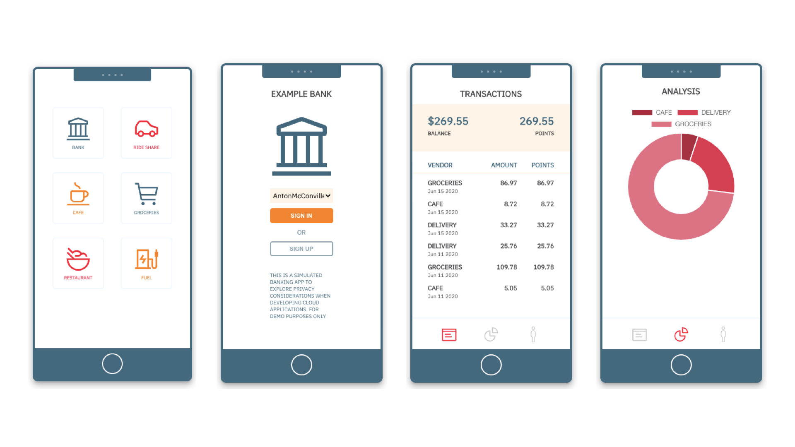

### Build secure microservices applicationss with Red Hat OpenShift on IBM Cloud

Building secure applications that ensure data privacy and security when deployed to a cloud environment is crucial for businesses that collect customer data, particularly for regulated industries like finance, retail, banking, and others. In this article, I introduce you to an example credit card application my team built to explore and share approaches for creating secure cloud-based applications with OpenShift 4.4 on IBM Cloud.
<!--EM: Do you think here we should highlight some of the specific things you were exploring/want to show?-->

### Our sample credit card application

We built the example credit card application with just a few straight-forward microservices that record dynamic user transactions in a PostgreSQL database. The JavaScript simulator application presents a Web-based view of a mobile application run by a Node.js service running inside an OpenShift cluster.

Want to see how it works? 

<button-link><text>Try out the credit card example</text><url>https://github.com/IBM/monitor-hands-on-lab/blob/master/docs/connect_device.md</url>
</button-link>

Create an account (with a generated name) <!--EM: Is this your real name or is this from that list in the drop-down>? If so, I'll probably change it: "Select a name from the drop-down to log in with" -->, return to the homescreen to make some charges that will be stored in a PostgreSQL database. <!--EM: I will probably put this in a sidebar beside the button-->

### Secure microservices application architecture

When building our credit card application, we had to keep security top of mind. The application is secured with HTTPS, and the interaction between the microservices is even encrypted with TLS via the OpenShift Service Mesh. Even the build pipeline for the application includes a scan of the codebase for security purposes. <!--EM: Is this something we can show? I feel like we might want to either expand on the steps in the diagram or very specifically call out the technology you used to build your app--> 

The following diagram outlines the architecture of the software:

<!--EM: Need to add new arch diagram and steps-->

#### How we built the credit card application <!--EM: I'm not sure if this is right? Alternates: 

The following pieces of content show you how we built and programmed the secure cloud application. Use the open source code and instructions to understand the steps we followed to build the secure cloud application with OpenShift 4.4: <!--EM: I replaced the following with what was in the spreadsheet Tracy is keeping with names, etc, but please reorder as appropriate. And if you think we need to truncate titles or whatever, that is fine.

- [Introduction to OpenShift 4](https://developer.ibm.com/articles/intro-to-openshift-4/), article
- [Threat modeling in the context of microservice architectures](https://developer.ibm.com/articles/threat-modeling-microservices-openshift-4/), article
- [Fun with OperatorHub](https://developer.ibm.com/tutorials/operator-hub-openshift-4-operators-ibm-cloud/), tutorial
- [Focus on data privacy with a back end for a mobile bank app](https://developer.ibm.com/patterns/privacy-backend-loyalty-app-openshift-4/), code pattern
- [Securing apps with a service mesh on IBM Public Cloud](), code pattern
- [Build serverless Node.js applications with the OpenShift Serverless operator](), tutorial
- [Build a Tekton Pipeline to deploy a mobile app back end to OpenShift 4](https://developer.ibm.com/tutorials/tekton-pipeline-deploy-a-mobile-app-backend-openshift-4/), tutorial

#### Conclusions

Building secure, private cloud applications is more important than ever. The credit card example application we built serves to:

- Share a working integration of OpenShift's latest features
- Explore security concepts and approaches for creating cloud-native applications

Here at IBM Developer, we plan to use this example to dig deeper into emerging features of OpenShift and hope to integrate with new [IBM Cloud for Financial Services](ibm.com/cloud/financial-services). Stay tuned to our [work in GitHub](https://github.com/IBM/loyalty).
