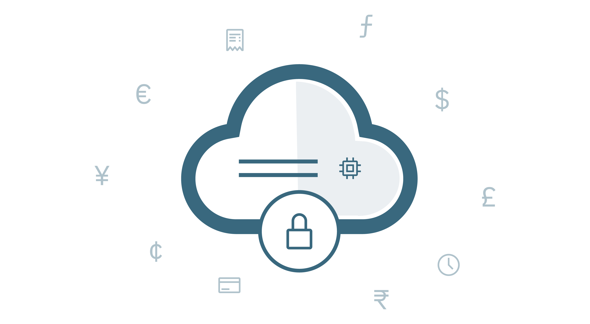

#### Building Secure Financal Apps on IBM Cloud
The sudden lockdown by 2020's pandemic caused most businesses to rethink their operating approaches, not least their reliance on 'the cloud'.

In a recent [Financial Times Cloud Webinar](https://live.ft.com/Events/2020/FT-Digital-Dialogues-Optimising-Cloud-to-Survive-the-Crisis) CIOs discussed some of the ways their businesses adapted to the crisis. One of them noted that 2 years of digital transformation was forced to happen in two months. Another mentioned that had the pandemic happened 10 years ago, they would have stuggled to keep going, because the cloud wouldn't have been an option.

At my own bank, my financial advisor wasn't able to work remotely, when the lockdown happened. She needed to be at a branch to access files. There wasn't enough space for everyone to be safely spaced, so she needed to work from a different branch, which even then offered restrictions on what she could see.

