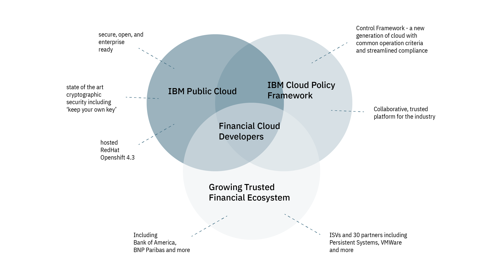

#### IBM Financial Services Ready Public Cloud

Financial services businesses are now able to safely build sensitive and confidential data, and critical business applications, on the public cloud with the introduction of [the World’s First FSS Ready Public Cloud](https://www.ibm.com/cloud/blog/ibm-fss-ready-public-cloud-uncompromising-security-and-compliance) from IBM.

**This pioneering platform brings on demand public cloud flexibility to financal segment developers so they can confidently and securely modernize, architect, and create apps with virtual machines, containers, microservices, along with a catalog of reliable services.**

Industry is entering a point of inflection, where the need for creating secure apps on public clouds is urgently becoming necessary. 

Recently, many businesses forced to accelerate their adoption of cloud technology because their employees are working from home. Without the cloud, many businesses would have found some operations more challenging at this time.

#### IBM Financial Cloud is for Developers

IBM Public Cloud is already an industry leading secure foundation for building enterprise grade applications on, with a full range of [security and privacy offerings and approaches](https://developer.ibm.com/articles/threat-modeling-microservices-openshift-4/) and state of the art [keep your own key cryptography](https://www.ibm.com/cloud/blog/announcements/keep-your-own-key-for-kubernetes-apps-with-highly-sensitive-data).

The new Financial Services Ready Public Cloud introduces the IBM Cloud Policy Framework - a necessary streamlined approach to reliably and efficiently create compliance regulated apps. IBM Cloud has worked with Bank of America to establish a collaborative platform that financial apps can follow a controlled approach to be built on.

Building on IBM's strong history within the financial industry, the FSS Ready Cloud is growing momentum with a trusted financial ecosystem including BNP Paribas and with ISVs and partners like VMWare. This ecosystem is refining the approach and strengthening the platform with each publicly hosted offering.

The diagram below shows how the Financial Services Ready Public Cloud is built on the same IBM Public Cloud that celebrates the industry leading OpenShift 4.3 platform.

#### Next steps

- Forbes [article](https://www.forbes.com/sites/moorinsights/2020/05/05/ibm-builds-out-its-financial-services-ready-public-cloud-ecosystem-with-more-isvs/#29a42e10730c ) on IBM Financial Services Ready Public Cloud

- Check out [IBM Boosts Security and Productivity with Red Hat OpenShift 4.3 on IBM Cloud](https://www.ibm.com/cloud/blog/red-hat-openshift-43-on-ibm-cloud), which highlights the industry leading benefits this release offers to IBM Cloud users.

- Become part of the team building solutions to fight the global challenges, COVID-19, and climate change as part of [Call for Code 2020 Global Challenge](https://developer.ibm.com/callforcode/) program.

- Attend workshops scheduled in your time zone at [Kubernetes with Red Hat OpenShift World Tour](https://developer.ibm.com/openshift-world-tour/) to get hands on experience with Kubernetes and the OpenShift container orchestration platform.

- Explore lots of great content on IBM Developer at [Red Hat OpenShift on IBM Cloud](https://developer.ibm.com/components/redhat-openshift-ibm-cloud/).

