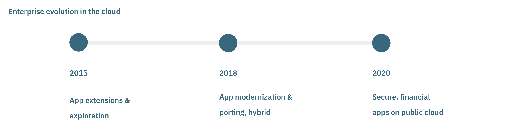
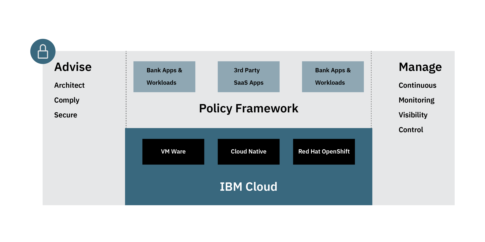

#### IBM Financial Services Public Cloud

Financial services businesses are now able to safely build sensitive and confidential data, and critical business applications, on the public cloud with the introduction of [the World’s First FSS Ready Public Cloud](https://www.ibm.com/cloud/blog/ibm-fss-ready-public-cloud-uncompromising-security-and-compliance) from IBM.

It is a breakthrough step for flexible and rapid development of next generation secure and private product offerings.

#### Cloud and the Enterprise

The Cloud has been evolving quickly, in a relatively short time. At first, enterprises began with tentative smaller experiments - creating extensions to apps, or adding new features to classic apps, to learn and understand the technolgy.

More recently enterprises have been convinced of the benefits of scale and economics - moving bigger legacy applications to the cloud, modernizing monolithic apps into efficient microservices, and building brand new concepts natively on the cloud. 

Today, the Cloud is established as the smart way to steer the future of a business with innovation, and agility.

Established enterprise businesses are very careful when handling sensitive data. Industry is entering a point of inflection, where the need for creating secure apps on public clouds is urgently becoming necessary. 

The current pandemic has highlighted just how essential the public cloud is for enterprises, with many businesses forced to accelerate their adoption of cloud technology because their employees are working from home. Without the cloud, many businesses would have found some operations more challenging at this time. This has quickly widened awareness of the benefits of cloud development, that some enterprises maybe wouldn't otherwise have seen the benefits of.

For some businesses, moving sensitive data or processing away from traditional back-end systems to the cloud is new territory, posing new considerations. High profile data breaches have occurred even with traditional systems. With the introduction of quality standards like GDPR, consumers have been continually growing more aware of the value of security and their privacy rights within their personal applications, which is a healthy thing.

<!-- PCI, HIPAA, GDPR, SOC1, and SOC2 Type 2 -->

It is exciting to see IBM develop a vision and design for the world’s first financial services-ready public cloud to address FSS institutions’ requirements for regulatory compliance, security and resiliency.  

<!-- Call this "IBM Financial Cloud is for Enterprises"?  -->
#### IBM Fincancial Service Heritage 

IBM will welcome financial services institutions, their suppliers, and independent software vendors (ISVs), to join the financial services-ready public cloud.  As its first collaborator, Bank of America will use the platform built on IBM’s public cloud to host key apps and workloads.

IBM has been a trusted partner with banks for over a hundred years. Financial institutions on all corners of the planet still rely on IBM solutions today. It is a heritage unmatched by any other Cloud company. It makes sense that IBM would pioneer a Financial Services Cloud.

#### IBM Financial Cloud is for Developers

The Financial Services Ready Public Cloud is built on the very same IBM Public Cloud that celebrates the industry leading OpenShift 4.3 platform.

In our IBM Developer labs, we're focusing a lot of our interest on Kubernetes, and OpenShift these days, because these are liberating platforms for 21st century development teams. 

OpenShift 4.3 in particular, curates a well considered, cutting edge collection of technologies that perfectly mix devops, serverless, service mesh and containers. 

The IBM Financial Services Ready Cloud, is almost mirroring the early stages of public cloud evoluton, by focusing on VM Ware in its early engagements. This helps establish the policy framework and regulation work in a public platform.

Some customers are also already beginning to explore container based solutions. Our development teams will be working closely with the Financial Cloud to create tutorials and reference models as the Financial Cloud emerges. It is an exciting, ambitious, and necessary evolutionary step.

## Get started by building your own online banking platform?

We know you're excited to get your hands on the new capabilities on OpenShift 4 on IBM Cloud. To get started quickly, check out the latest content we’ve developed.

- [An introduction to OpenShift 4](https://developer.ibm.com/articles/intro-to-openshift-4/)

- [Three key features for developers on OpenShift 4 on IBM Cloud](https://developer.ibm.com/videos/three-key-features-openshift-4-on-ibm-cloud/)

- [Focus on data privacy with a back end for a mobile loyalty app](https://developer.ibm.com/patterns/privacy-backend-loyalty-app-openshift-4/)

- [Fun with Operator Hub](https://developer.ibm.com/tutorials/operator-hub-openshift-4-operators-ibm-cloud/)

- [Build a Tekton Pipeline to deploy a mobile app back end to OpenShift 4](https://developer.ibm.com/tutorials/tekton-pipeline-deploy-a-mobile-app-backend-openshift-4/)

- [Threat modeling in the context of microservice architectures](https://developer.ibm.com/articles/threat-modeling-microservices-openshift-4/)

- [Deploy a sample currency exchange app to OpenShift using Red Hat Universal Base Image](https://developer.ibm.com/patterns/deploy-to-openshift-4-redhat-universal-base-image/)

## Next steps

<!-- other links to add 

https://newsroom.ibm.com/2019-11-06-IBM-Developing-Worlds-First-Financial-Services-Ready-Public-Cloud-Bank-of-America-Joins-as-First-Collaborator
https://www.forbes.com/sites/moorinsights/2020/05/05/ibm-builds-out-its-financial-services-ready-public-cloud-ecosystem-with-more-isvs/#29a42e10730c
https://www.ibm.com/cloud/financial-services
https://www.ibm.com/industries/banking-financial-markets/resources/back-office/modernize/
-->

- Check out [IBM Boosts Security and Productivity with Red Hat OpenShift 4.3 on IBM Cloud](https://www.ibm.com/cloud/blog/red-hat-openshift-43-on-ibm-cloud), which highlights the industry leading benefits this release offers to IBM Cloud users.

- Become part of the team building solutions to fight the global challenges, COVID-19, and climate change as part of [Call for Code 2020 Global Challenge](https://developer.ibm.com/callforcode/) program.

- Attend workshops scheduled in your time zone at [Kubernetes with Red Hat OpenShift World Tour](https://developer.ibm.com/openshift-world-tour/) to get hands on experience with Kubernetes and the OpenShift container orchestration platform.

- Explore lots of great content on IBM Developer at [Red Hat OpenShift on IBM Cloud](https://developer.ibm.com/components/redhat-openshift-ibm-cloud/).

