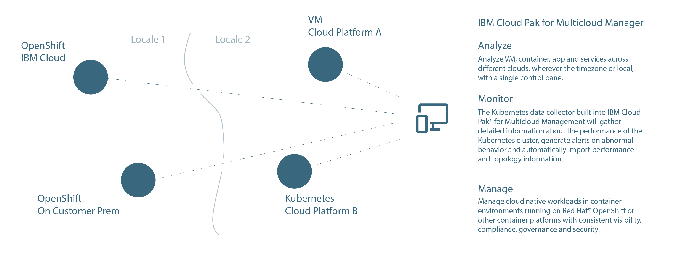

#### IBM Cloud Pak for Multi-Cloud Manager

When digital businesses evolve in the Cloud, operational demands can easily result in cloud native solutions that run on more than one cloud platform, in different regions or geographies, with local governance demands. Keeping track of the big picture can pose challenges, while hopping from one control panel to another. 

Enter [IBM Cloud Pak for Multi-Cloud Manager](https://www.ibm.com/cloud/cloud-pak-for-management) version 2 which empowers developers, and developer operations teams to create time saving panoramic insight for businesses whose software runs in more than one cloud platform. It aligns efficent, centralized monitoring and control of related applications, from a well coordinated user interface.

Here are just a few of the game changing features of CP for MCM:

[Manage](https://www.ibm.com/cloud/cloud-pak-for-management/multicloud): both cloud native and VM environments with actionable data delivered on a single dashboard

[Monitor](https://www.ibm.com/cloud/cloud-pak-for-management/orchestrate-hybrid-monitoring): The Kubernetes data collector built into IBM Cloud Pak® for Multicloud Management will gather detailed information about the performance of the Kubernetes cluster, generate alerts on abnormal behavior and automatically import performance and topology information.

[Automate](https://www.ibm.com/cloud/cloud-pak-for-management/use-cases): deployment, management and governance of application workloads in VM and container environments and proactively manage IT infrastructure from a single control plane

[Test](https://www.ibm.com/cloud/cloud-pak-for-management/orchestrate-hybrid-monitoring): Unforseen scenarios can arise in software systems, in the blink of an eye. So setting up your apps and servers with synthetic agents that periodicially test pages and APIs, and report back immediately with anomolies, is a big help. 

#### Managing the growth of a digital idea

Many of the apps you use from your phone every day, although recognizable around the world, may be served from different clouds, or work different ways in other locals. Man years of effort have been shrunk down into a convenient little rectangle on your phone.

Behind the scenes, an initial concept, or feature can quickly turn into a diversified set of related apps, cooperating between different platforms, whether they be on premise, or on a selection of cloud vendors, runtimes and policies. 

It is an exciting, yet sometimes challenging landscape to work in, and is a fascinating emerging discipline for developers and operational teams. It can be navigated more easily with IBM's new Cloud Paks for Multi-Cloud Management solution.
