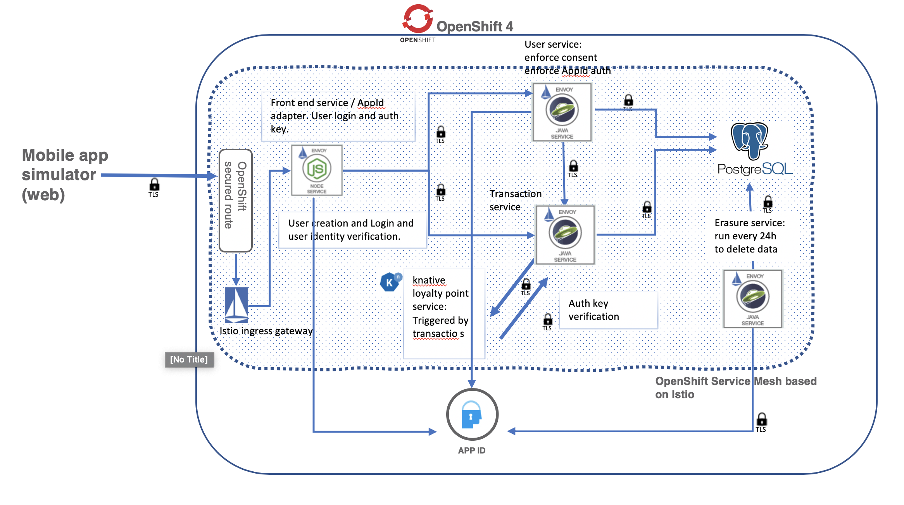

# Microservices with the OpenShift Service Mesh

In this pattern, we show how to enable OpenShift Service Mesh (based on Istio) for the
banking simulator microservice back-end described here: Final link tbd.

## Introduction

The OpenShift ServiceMesh is a layer built on top of Istio, based on the Maistra operator.  In this patter, we show how to take the microservice based application and
make the necessary modifications to deployment scripts, Dockerfiles and network policies to allow it to work with Istio service mesh.  Although the primary goal is security provided by mTLS between services and via the ingress, once Istio is configured, you have all the flexibility of its traffic management and security policies.  In this example, we will install OpenShift Service mesh and configure the Example Bank project to use mutual TLS between services.  Once inside the Istio mesh, you can also take advantage of its traffic management, telemetry and observability features.

## Included Components

- [IBM Managed OpenShift](https://www.ibm.com/cloud/openshift)
- [OpenLiberty](https://openliberty.io)
- [App ID](https://www.ibm.com/cloud/app-id)
- [LogDNA](https://www.ibm.com/cloud/log-analysis)
- [OpenShift ServiceMesh](https://docs.openshift.com/container-platform/4.3/service_mesh
- [OpenShift Serverless](https://www.openshift.com/learn/topics/serverless)

## OpenShift Service Mesh vs. Istio

You will see the term "maistra" appear - this is the name of the operator used to implement the OpenShift ServiceMesh. The version of Istio available with OpenShift 4.3 is 1.4.6. 

See the differences between the OpenShift service mesh and upstream Istio here:

- [Compoarison with Istio](https://maistra.io/docs/comparison-with-istio/)
- [OpenShift Service Mesh Architecture](https://docs.openshift.com/container-platform/4.3/service_mesh/service_mesh_arch/ossm-vs-community.html#ossm-vs-community)
- [Maistra releases](https://maistra.io/docs/installation/release-notes/)

# Prerequisites

1. Log in, or create an cccount on [IBM Cloud](https://cloud.ibm.com)
2. Provision an OpenShift 4.3 cluster on on [IBM Cloud](https://cloud.ibm.com/docs/openshift?topic=openshift-openshift_tutorial)
3. Create a [project](https://docs.openshift.com/container-platform/4.3/applications/projects/configuring-project-creation.html) called `example-bank`.

# Architecture

The example bank system includes several microservices for handling user authentication and transacton mechanics. (TBD: Link to bank pattern.) (Todo: replace with Glenn's diagram :)



## Step 1: Installing the OSSM Operator

Follow the instructions to install the necessary operators, in this order. (Note OSSM=OpenShift ServiceMesh).

1. ElasticSearch Operator
2. Jaeger Operator
3. Kialie Operator
4. Red Had OpenShift ServiceMesh Operator

Official instructions are here: https://docs.openshift.com/container-platform/4.3/service_mesh/service_mesh_install/installing-ossm.html#ossm-operatorhub-install_installing-ossm

Once complete, your "Installed Operators" screen will show these operators installed.


## Step 3: Control Plane and Member Roll

In this step, we'll use the OSSM operator to create two new instance - a Control Plane and a Service Mesh Member Roll. we'll install the control plane into the `istio-system` project (create a project with this naame if not done in the previous step.)  Note that while it is possible to enable global auto-mTLS, we will enabling it selectively only for specific services because global TLS causes issues with triggering the knative transaction processing service.

- Install the Control Plane. No changes from the default template are needed.


- Install the OpenShift Member Roll (Sometimes abbreviated `SMMR`). One change is needed to the default template, noted with the red box. Application pods that are part of an `SMMR` will be managed by this Istio control plane  (e.g. sidecars will not be injected into pods in namespaces not part of a ServiceMesh Member Roll.)


And click "create".

You can verify the project is in the mesh member roll with this (note: requires the OpenShift `oc` CLI.)

```
$ oc get smmr -o yaml --all-namespaces | egrep -A2 'ControlPlane|configuredMembers'
kind: ServiceMeshControlPlane
name: basic-install
uid: 21b19fb5-f8c4-4ab0-831a-86e335ad9999
--
configuredMembers:
- example-bank
meshGeneration: 8
```

## Step 4: Deploy the services

Follow the steps in the [Example Bank application](https://github.com/IBM/loyalty/blob/main/README.md) to deploy all the components of the back-end here.  You will see these services running:

 - Font-end service (Node.js)
 - User management service (Java / OpenLiberty)
 - Transaction processing (Java / OpenLiberty)
 - User cleanup CronJob ( Java / OpenLiberty)
 - serverless (knative) loyalty point service (Node.js)

Ensure that the project they are deployed in is `example-bank`, to match the 
project in the ServiceMeshMemberRoll instance.

## Step 3: Check-out service mesh-enabled branch

Check-out the `service-mesh` branch, which includes modified deployment scripts to allow the application to function in a Red Hat Service Mesh environment.

```
git checkout service-mesh
```

This will checkout updated YAML manifests to enable operationinsdie the mesh.

## Step 4: Review and apply changes

Let's look at the changes being introduced to allow the Example Bank application to work with the service mesh and run the necessary commands to get our deployments updated.

#### Enable sidecar injection:

Note that there is a new annotation in all the deployment manifests:

```
template:
  metadata:
    labels:
      app: mobile-simulator
    annotations:
      sidecar.istio.io/inject: "true"
```

The `sidecar.istio.io/inject: "true"` is the mechanism the service mesh uses to inject the Envoy proxy into the pod. Note that labeling the namespace to enable sidecar injection for all bservices will not work with OpenShift. This allows more fine-grained control of which applications use the Istio proxy. 

#### Ingress gateway

The istio ingressgateway is needed to pass traffic into the service mesh.
 
Excerpt from `bank-istio-gw.yaml`: 
```
apiVersion: networking.istio.io/v1alpha3
kind: Gateway
metadata:
  name: simulator-gateway
spec:
  selector:
    istio: ingressgateway # use istio default controller
  servers:
  - port:
      number: 80
      name: http
      protocol: HTTP
    hosts:
    - "*"
```

Note that an OpenShift route is not automatically created from this gateway unless the [Automatic Route Creation (IOR)](https://maistra.io/docs/comparison-with-istio/ior/) feature is enabled.  Later on in the pattern, we'll create a secured route manually, using the OpenShift console.

Delete existing routes and create the Istio gateway:

```
oc delete routes --all
oc apply -f bank-istio-gw.yaml
```

#### Destination rules and policy

Destination rules enable mTLS between services that are inside the mesh. Provided via `bank-istio-destination-mtls.yaml` and `bank-istio-policy.yaml`.  Once applied, these rules enforce encrypted and authenticated traffic between bank services.

```
oc apply -f bank-istio-policy.yaml -f bank-istio-destination-mtls.yaml
```

#### Special steps to enable knative processing.

These steps are necessary to enable traffic routed to knative serving and trigger the creation of the transaction point processing service:

```
oc label namespace knative-serving serving.knative.openshift.io/system-namespace=true --overwrite

oc label namespace knative-serving-ingress serving.knative.openshift.io/system-namespace=true --overwrite

oc apply -f bank-knative-service/network.yaml
```

Note: The namespace in `bank-knative-service/network.yaml` is `example-bank` - this namespace needs to match the one where services are deployed.

#### Patch the database service to inject the sidecar proxy. 

The database xsinstance must have the sidecar to handle TLS aspects of mesh traffic.

```
$ kubectl patch deployments.apps creditdb -p '{"spec":{"template":{"metadata":{"annotations":{"sidecar.istio.io/inject":"false"}}}}}'
```

Verify that the database pod now contains two containers.

#### Updates for Kubernetes jobs

Delete the existing user deletion job and apply the new manifest. 

```
oc delete -f bank-user-cleanup-utility/job.yaml
oc apply -f bank-user-cleanup-utility/job.yaml
```

The changes being introduced are a new Docker images that changes the command being run:

```
CMD sleep 30 && java -jar /opt/app/user-cleanup-utility-1.0-SNAPSHOT.jar ; curl -X POST http://localhost:15020/quitquitquit
```

The  `sleep 30`  allows the Istio proxy time to initialize and start before the Java app runs - communication to the other services in the mesh will fail if the sidecar is not running.  The `curl` to `localhost:15020` causes the Istio sidecar to exit after the cleanup completes, allowing Kubernetes to move the job to the `Completed` state.


#### Create a secure rout with OpenShift


## License

This code pattern is licensed under the Apache License, Version 2. Separate third-party code objects invoked within this code pattern are licensed by their respective providers pursuant to their own separate licenses. Contributions are subject to the [Developer Certificate of Origin, Version 1.1](https://developercertificate.org/) and the [Apache License, Version 2](https://www.apache.org/licenses/LICENSE-2.0.txt).

[Apache License FAQ](https://www.apache.org/foundation/license-faq.html#WhatDoesItMEAN)


## Resources

https://docs.openshift.com/container-platform/4.3/service_mesh/service_mesh_day_two/prepare-to-deploy-applications-ossm.html#deploying-applications-ossm

More documentation:
https://github.com/Maistra/istio-operator

Installation:
https://maistra.io/docs/installation/operator-installation/
