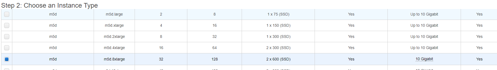
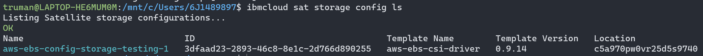

# Using IBM Cloud Satellite and IBM Cloud Database to run Example Bank on OpenShift in AWS

## Introduction to IBM Cloud Satellite

In this code pattern, we show how to deploy a microservice based back-end in OpenShift 4 running on an IBM Cloud Satellite Location on virtual servers running on AWS infrastructure. IBM Cloud Satellite allows you to connect your own compute infrastructure -- either on-prem or running in another cloud provider -- to a central control point on IBM Cloud, allowing for consistent management of OpenShift and other supported services like databases. In this pattern, we'll create a Satellite location using Schematics based automation, then deploy and attach additional VMs from AWS to use for the IBM Cloud Database service , and deploy OpenShift (managed by IBM Cloud) on those virtual machines. We'll set up App ID and configure our database, and finally, we'll deploying our Node.js and Java microservice-based back-end to OpenShift. The application will be running on the AWS VPC hosts and will be made accessible via an OpenShift route, which we'll be able to access via VPN.

## Architecture 

We are running all our workloads in EC2 instances inside one VPC. Note that this includes control plane for  Satellite, OpenShift worker nodes, and nodes required for IBM Cloud Databases for PostgreSQL. In addition, we use the IBM Cloud App ID service to maintain a user directory for our sample app.


# Included components
- [IBM Cloud Satellite](https://www.ibm.com/cloud/satellite)
- [IBM Managed OpenShift](https://www.ibm.com/cloud/openshift)
- [OpenLiberty](https://openliberty.io)
- [App ID](https://www.ibm.com/cloud/app-id)
- [IBM Cloud Databases](https://www.ibm.com/cloud/databases-for-postgresql)

# Prerequisites

- Log in, or create an account on [IBM Cloud](https://cloud.ibm.com)
- Have the following tools available in your terminal:
  - install [ibmcloud CLI](https://cloud.ibm.com/docs/cli?topic=cli-getting-started)
  - install ['oc' OpenShift CLI](https://cloud.ibm.com/docs/openshift?topic=openshift-openshift-cli)
  - `jq` - command line JSON parser used by set-up scripts.

# Steps

Listed below are the main parts of this guide:

1.  [Create New Satellite Location](#create-new-satellite-location)

2.  [Generate Satellite Script](#generate-satellite-script)

3.  [Create and Attach Additional Hosts to Satellite
    Location](#create-and-attach-additional-hosts-to-satellite-location)
    
4. [Creating an AWS EBS Storage Configuration for
    Satellite](#creating-an-aws-ebs-storage-configuration-for-satellite)

5.  [Enable Public Endpoints on the Satellite Control Plane](#enable-public-endpoints-on-the-satellite-control-plane)

6.  [Grant Databases for PostgreSQL Authorization to Satellite
    Cluster](#grant-databases-for-postgresql-authorization-to-satellite-cluster)
    
7. [Deploying IBM Cloud Databases in Satellite
    (PostgreSQL)](#deploy-db)

8.  [Create Storage Assignment for PostgreSQL Service
    Cluster](#storage)
    
9. [Testing your PostgreSQL Deployment via psql
    CLI](#testing)

10. [Provision OpenShift Cluster on Satellite
    Hosts](#ocp)

11. [Deploy Example Bank App on Satellite OpenShift with Satellite
    PostgreSQL](#bank-app)

Note: Please see the following documentation for more details:

1. <https://cloud.ibm.com/docs/satellite?topic=satellite-locations>

2. <https://cloud.ibm.com/docs/satellite?topic=satellite-locations#location-create>

## Create new Satellite location

We need to create six hosts of 8x32 with 300 GB: three of these hosts will
be the control plane and the other three will be a part of the six total hosts needed for PostgreSQL ICD.

Go to IBM Cloud / Satellite/ Locations and *Create A Satellite Location*


Click on "AWS Quick Start", input your AWS access and secret keys, and click on "Fetch options from AWS".


We will start of with 6 hosts of 8x32 with 300 GB. 


### Create location

Now, since we chose the AWS Specific Satellite Location and entered our
AWS Access Credentials, IBM will create a Schematic that runs Terraform
to automatically provision the AWS VPC, Instances, Security Groups, etc.

You can see this by going to your newly created Satellite Location, and
then click the “Manage in Schematics” blue tab in the top right:


From here, you can see the Terraform job ran that created the AWS EC2
instances, VPC, and more


And you can see them in the AWS Console as well (Make sure you are in
the correct region.)


**Generate Script**

For some EC2 hosts, we need to provision them manually and run this script (which is specific to this Satellite location) to attach it to IBM Cloud for management. 

Go to your Satellite Location and click “Attach Host”. We will need to
download this script so that we can add the remaining 3 hosts:


After downloading the Script, we have to make a change to the script.
Open the script in VS Code (or another editor) and navigate to line 19. As per the following
[guide](https://cloud.ibm.com/docs/satellite?topic=satellite-aws#aws-host-attach),
step 3, we need to add the following section:

```
API_URL="https://origin.us-east.containers.cloud.ibm.com/"

# Enable AWS RHEL package updates
yum update -y
yum-config-manager --enable '\*'
yum repolist all
yum install container-selinux -y
echo "repos enabled"
```

Now, save this script. We will use this script in the
next steps when creating the EC2 hosts.

## Create and Attach Additional Hosts to Satellite Location

Like the original guide mentioned, we need the following types of AWS
Hosts in our Satellite location for Postgres ICD to run:

-   Three type 8x32 hosts:

    -  On AWS, choose three hosts of type AWS `m5d.2xlarge`.


-   Three type 32x128 hosts

    -   on AWS choose three hosts of type AWS `m5d.8xlarge`.

Now, we already have the three type 8x32 (AWS m5d.2xlarge) provisioned
and attached in our Satellite location, but we now need to provision the
three type 32x128 (AWS m5d.8xlarge) EC2 nodes in AWS and attach them to
the IBM Cloud Satellite Location.

First, we will provision the nodes in our AWS VPC. Follow the following
instructions under **Manually adding AWS hosts to Satellite**


Click “Launch Instances” in the top right. Refer to one of the
previously created instances and their AMI to make sure the hosts work
correctly on the previously created VPC.

Select the correct m5d.8xlarge Instance type



Choose 1 for the “Number of instances” and fill out remaining options
like other previous instances. I know this picture shows 3 instances
being created, but it is important to only launch one instance at a time
so that we can manually assign each instance to each of the three
subnets. This is important because we need to have 1 of each of the
32x128 hosts in the three different availability zones as IBM Cloud
Satellite requires the hosts to be spread out across the three zones.


**IMPORTANT:** Before moving on to the next steps, make sure you expand
the “Advanced Details” section and enter your edited Attach Host Script
file in the “User Data” section.


At the **Add Storage** tab, expand the root volume to a minimum of 100
GiB


At the **Add Tags** section, add an organization tag to keep track of
the *ibm-satellite* key. Look at your previously auto-created EC2
instances to find the correct value. I also added a *zone* key to keep
track of the availability zone they are in.


In the **Configure Security Group** tab, make sure to select the
existing security group that was created by the IBM Terraform Schematic
in AWS. You can also find this security group ID in one of the
previously created Instances’ Details section.


Now, launch your instances in AWS EC2. After \~10 minutes, you should
see them attached to your new IBM Satellite Location assuming you
entered the script correctly when creating the instances.


## Creating an AWS EBS Storage Configuration for Satellite

Before we can deploy the ICD to our Satellite service cluster, we need
to use the CLI to create an AWS EBS Storage Configuration so that our
cluster can dynamically provision EBS Storage as needed.

I’ll be following these two guides closely:

<https://cloud.ibm.com/docs/databases-for-postgresql?topic=cloud-databases-satellite-aws>

<https://cloud.ibm.com/docs/satellite?topic=satellite-config-storage-ebs>

Log into IBMCloud CLI. Run the following commands

```
ibmcloud sat location ls

ibmcloud target -r us-east
```


You should see your Satellite location in the list. Take note of the
Location ID. That will be used in the next command.
```
ibmcloud sat storage config create \\ --name
'aws-ebs-config-storage-testing-1' \\ --template-name
'aws-ebs-csi-driver' \\ --template-version '0.9.14' \\ --location
'${LOCATION_ID}' \\ -p "aws-access-key=${SAT_EBS_ADMIN_KEY_ID}" \\ -p
"aws-secret-access-key=${SAT_EBS_ADMIN_KEY}"
```
In my case, the command looked like the following:

```
ibmcloud sat storage config create --name
'aws-ebs-config-storage-testing-1' --template-name 'aws-ebs-csi-driver'
--template-version '0.9.14' --location 'c5a970pw0vr25d5s9740' -p
"aws-access-key=\<…>" -p "aws-secret-access-key=\<…>”
```
You can verify that the config was created by running the following
command.

`ibmcloud sat storage config ls`



## Enable Public Endpoints on the Satellite Control Plane

For more information, see:

<https://cloud.ibm.com/docs/databases-for-postgresql?topic=cloud-databases-satellite-aws>

Retrieve your public endpoints/IP’s from your AWS portal for the control
plan hosts. These are **NOT** the same as the IP addresses listed in the
Satellite Location Hosts page:


However, you can use those private IP Addresses of the control plane
hosts in IBM Cloud to identify the control plane EC2 instances in AWS
and get their Public IP. Note the Public IPs of the control plane
instances. In my case, the public IP’s were the following

Public IP’s:

```
34.201.210.207

18.208.137.255

3.88.209.212
```

Then, run the following command

`ibmcloud sat location dns register --location \<location> --ip
\<public-ip1> --ip \<public-ip2> --ip \<public-ip3>`


Save this output for a future step.

## Grant Databases for PostgreSQL Authorization to Satellite Cluster

Reference:
<https://cloud.ibm.com/docs/databases-for-postgresql?topic=cloud-databases-satellite-aws>

Go to IBM Cloud / Manage / Access (IAM) Console / Authorizations:


From here, create a new Authorization. The source service is the service
that is granted access to the target service. The roles you select
define the level of access for this service. The target service is the
service you are granting permission to be accessed by the source service
based on the assigned roles. Use the following details

-   In the **Source Service** field, select **Databases for Postgres**

-   In the **Target Service** field, select **Satellite**.

-   Select all options:

    -   **Satellite Cluster Creator**

    -   **Satellite Link Administrator**

    -   **Satellite Link Source Access Controller**

-   Then **Authorize**.


## <a name="deploy-db"></a>Deploying IBM Cloud Databases in Satellite (PostgreSQL)

References:

<https://cloud.ibm.com/docs/databases-for-postgresql?topic=cloud-databases-satellite-aws>

<https://cloud.ibm.com/docs/cloud-databases?topic=cloud-databases-provisioning>

Once you have prepared your satellite location and granted service
authorization, you can provision your ICD Satellite Deployment by
selecting the Satellite location you have created in the Location
dropdown of the provisioning page. For thorough documentation of the
provisioning process, see the relevant Provisioning documentation for
your ICD Satellite deployment. Once you have created a new service
instance, this instance will appear in the IBM Cloud Resource List as
Provisioned.

Go to the following link to start the provisioning:
<https://cloud.ibm.com/databases/databases-for-postgresql/create>


If all goes well, then the PostgreSQL Service Cluster will be
provisioned and will automatically assign the needed hosts to the
Cluster. You should see the following in your satellite location.


**NOTE:** My screenshot above (and some other screenshots below) show a
“Databases for Redis” service and not PostgreSQL. This is because I
deployed Redis into my satellite location first. However, **you can
deploy multiple ICD instances (Redis, PostgreSQL, etcd) into the same
AWS 6 host service.** They can reside on the same hosts, using the same
resources, just note that the service name in the satellite location
will be named after whatever ICD you deploy into your location first. My
PostgreSQL ICD is also residing in the same hosts, and in the same
service.

**ISSUE:**

After provisioning, you may see the following warning:


If you click on the Assign hosts, you’ll see that Databases for
PostgreSQL is asking for CPU:32 hosts in the us-east-1c and
us-east-1b regions. When we manually provisioned these 32 CPU hosts,
they were all created in the same Zone if you launched 3 instances at
once. We now need to move two of them to east-1b and east-1c
respectively. Unfortunately, you can’t move pre-existing EC2 instances to
another availability zone.

Make new instance, but make sure to choose the other two subnets when
creating it, which will cause it to deploy in a different availability
zone, also add a “zone” tag just in case.


## <a href="storage"></a>Create Storage Assignment for PostgreSQL Service Cluster

When the service cluster is available in your Satellite location, the
next step is to create a Satellite storage assignment. This will allow
the service cluster to create volumes on the previously configured
storage.

First, we need to get the Cluster ID

`ic sat location ls`


Get the ICD Cluster ID and use it to create a storage assignment.

`ic sat service ls --location aws-eastcoast-ICD`

Now, create the storage assignment from the “Databases for
Redis/PostgreSQL” Service Cluster with the following command

```
ibmcloud sat storage assignment create --name "ebs-assignment"
--service-cluster-id \<Databases for PostgreSQL Service Cluster
ID> --config 'aws-ebs-config-storage-testing-1'
```


You can verify that the Storage was created by running

`ibmcloud sat storage assignment ls`


Within ~30 minutes of assigning the storage, you should see your
PostgreSQL Satellite Database be deployed in IBM Cloud Resource List:


## <a href="testing"></a> Testing your PostgreSQL Deployment via psql CLI

To test your PostgreSQL deployment, you will want to connect to the
instance via CLI. However, since the Postgres Instance is running on
AWS, in a VPC, you won’t be able to connect to the instance via CLI on
your local machine until you set up a VPN connection to the VPC.

Another option to access your Postgres instance is to create a EC2 VM inside the VOC. I will be using a “Standby” VM Satellite Host in AWS. What this
means is that this AWS EC2 instance will be created the same way that we
created the previous EC2 instances, and it will get recognized by our
Satellite location, but we won’t assign it to any service in the
Satellite Location because we want to SSH into this instance. If we
assign the Standby VM to a service in IBM Cloud Satellite, we will lose
SSH privileges.

So we will create a new EC2 instance in AWS in the same location and VPC
as our other Satellite Hosts:

First, we need to import our CEH SSH Key into AWS to use for our
instance. Go to the [EC2
Console](https://console.aws.amazon.com/ec2/v2/home?region=us-east-1#Instances:)
and go to “Key Pairs” in the Left Tab Menu


And then go to “*Actions*” and “*Import Key Pair*”


Now, go and launch a new EC2 instance.

According to the following
[requirements](https://cloud.ibm.com/docs/satellite?topic=satellite-host-reqs),
the host must be a minimum of 4x16, so we will use the m5d.xlarge
requirement


Follow the earlier instructions to add this Instance into your VPC and
security group, etc.

Right before you launch, make sure to use the existing SSH Key you
imported before so you can SSH into the instance.


You should see your host show up in your satellite location. Do **NOT**
assign it to any service as you will lose SSH ability if you do.


Edit the security group that your instances use to allow SSH Inbound on
Port 22. You can specifically add your Home Router IP, or just use
0.0.0.0 to allow all connections, even though you might get hit by
spamming SSH attempts.


Now, connect to your EC2 instance with your SSH key


Install the latest redli release for Linux on

`sudo yum install postgresql`

Then, download the TLS Certificate in your PostgreSQL Satellite Database
Instance in IBM Cloud


And then transfer this file over to your EC2 instance from your local
machine

```
scp -i \~/.ssh/cehsshkey \<cert file>
<ec2-user@3.238.81.253:/home/ec2-user>
```


And now you should see it in your SSH’ed into EC2 Instance


Once the SSL Cert is in transferred to the EC2 SSH Host, SSH into the
EC2 host and run the following command you can copy from the CLI Public
endpoint, or from your service credentials from the IBM Cloud Postgres
instance as well. However, I was getting the issue with using the last
argument “sslmode=verify-full”. If you are getting issues connecting,
delete that argument, like I did in the screenshot below, and you should
be able to connect. Get the username/password from your service
credentials in your PostgreSQL Instance on IBM Cloud Satellite.

```
PGPASSWORD=$PASSWORD PGSSLROOTCERT=86efc6db-1d65-4f5e-a779-0ca98226adcb
psql
"host=3058936a-fe29-45f2-81ce-5f558438fa79.c5ad27tw0psvfits974g.databases.appdomain.cloud
port=30819 dbname=ibmclouddb user=$USERNAME sslmode=verify-full"
```


List the database with “\\l”. Keep in mind the previous log in command I
used will log into the ibmclouddb.


## <a href="ocp"></a> Provision OpenShift Cluster on Satellite Hosts**

For the next few pages/sections, we will be focusing on an application
that is meant to reside within the satellite location, running on a Red
Hat OpenShift Cluster in the same AWS VPC. This means we will need to
provision a OpenShift Cluster on AWS Hosts before we can continue. Go to
your AWS console, and provision 3 m5d.xlarge instances across 3
different availability zones, like we did in previous steps for the ICD
workload hosts. Attached below are some screenshots of the AMI, Instance
Type, and Storage I used for each host.


Once the 3 hosts are provisioned, and they are showing up in your as
*Unassigned* in your Satellite location hosts, we will now assign them
to an OpenShift Cluster. Go to IBM Cloud / OpenShift / Clusters / Create
Cluster.

Under *Infrastructure*, ensure you choose “Satellite”, and choose your
satellite location that as the 3 hosts available to run your OpenShift
Cluster. Ensure you only assign 1 worker to each zone, and that the
vCPUs and Memory are the same as your m5d.xlarge EC2 instances. Once
created, you should see the cluster created under *Services* in your
sat. location


**IMPORTANT:** You will not be able to access the OpenShift Console for
this cluster yet as it is located within the AWS VPC and uses the
private IPs for the cluster worker nodes, and you do not have a VPN
set-up. Use a procedure similar to the following: https://blog.scottlowe.org/2021/02/22/setting-up-wireguard-for-aws-vpc-access/. Note that in addition to following these steps, you'll need to expose port 51280 UDP on the VPN.  For more Satellite specific steps, visit: https://cloud.ibm.com/docs/openshift?topic=openshift-access_cluster#access_vpn_openshift.


You should now have access to your OpenShift Cluster console, the `oc` CLI,
and `kubectl` commands. You will use them in the following section.

## <a href="bank-app"></a> Deploy Example Bank App to OpenShift Satellite Cluster

We will be deploying the following app on our Satellite OpenShift
Cluster running on AWS Hosts:
<https://github.com/IBM/example-bank/tree/satellite>. This application will be running on the same AWS VPC as the PostgreSQL
ICD we provisioned earlier. 

First, clone the following repository onto your local machine because we
will be utilizing many deployment scripts located in this example bank
repository. Then, make sure to use the “satellite” branch of the
repository as this contains the correct deployment scripts/configuration
for a Satellite cluster.

```
git clone https://github.com/IBM/example-bank.git
git checkout satellite
```

Now, log into your OpenShift cluster after setting up your VPN into the
VPC, and copy the login command and paste that command into your
terminal to get `kubectl` access to your cluster.


Create a new namespace to house the resources of the example bank
application, and switch to that namespace for the remainder of this
tutorial.

```
kubectl create ns example-bank
oc project example-bank
```

Now, navigate to the example-bank cloned directory and cd into
“scripts”. Once there, also ensure that you are logged into your IBM
Cloud account by going to IBM Cloud, and going to the account tab in the
top right, and copying the login command for `ibmcloud` CLI.


Now, once you are logged into that terminal as well, we'll start by running a script to create a free instance of App ID in your cloud account.  *Make sure you are logged in to your IBM Cloud account and that `ibmcloud` CLI is available.*

```
$ cd scripts
$ ./createappid.sh

App ID instance created and configured
Management server: https://**.appid.cloud.ibm.com/management/v4/**
Api key:           YOUR_API_KEY
Auto-generated
appid-example-bank-credentials
```

Save the Management server and API key from above as environment variables `MGMTEP` and `APIKEY`, as they will be used in a subsequent step.

```
 $ ./createsecrets.sh $MGMTEP $APIKEY
```


Next, you need to manually create the last secret needed for the database used by the Example Bank application. This secret contains the credentials for your
PostgreSQL instance. Get your service credentials by going to your IBM
Cloud / Resource List / Postgres Sat. ICD instance / Service
Credentials.


Copy and note these credentials as they will be used to connect to your
PostgreSQL instance.

Use the following template to create your secret, with all the \<…>
fields from your service credentials.

```
kubectl create secret generic bank-db-secret
--from-literal=DB_SERVERNAME=\<hostname>
--from-literal=DB_PORTNUMBER=\<port>
--from-literal=DB_DATABASENAME=example
--from-literal=DB_USER=\<username>
--from-literal=DB_PASSWORD=\<password>
```

Now, all your necessary secrets should be created. Next, we will deploy
the different microservices of the example bank application. Run the
following command to first apply a job yaml that will install the
necessary schema in our PostgreSQL database.

`oc apply -f data_model/job.yaml`

And verify the status by running the following commands

```
$ oc get jobs

NAME COMPLETIONS DURATION AGE
cc-schema-load 1/1 29s 15m

$ oc get pods

NAME READY STATUS RESTARTS AGE
cc-schema-load-xcfrs 0/1 Completed 0 15m

$ oc logs cc-schema-load-xcfrs

CREATE EXTENSION
CREATE DATABASE
You are now connected to database "example" as user "postgres".
CREATE SCHEMA
SET
CREATE TABLE
CREATE TABLE
CREATE TABLE
```

Next, we will deploy the transaction and user microservices with the
following commands.

```
cd bank-app-backend
oc apply -f transaction-service/deployment.yaml -f
user-service/deployment.yaml
```

Verify the services are running with the following commands.

```
$ oc get services

NAME TYPE CLUSTER-IP EXTERNAL-IP PORT(S) AGE
transaction-service ClusterIP 172.21.215.251 \<none> 9080/TCP 3d23h
user-service ClusterIP 172.21.64.7 \<none> 9080/TCP 3d23h

$ oc get pods

NAME READY STATUS RESTARTS AGE
transaction-service-55b9bfb4cd-jzkgq 1/1 Running 0 26s
user-service-55b99c5c44-dpd9k 1/1 Running 0 25s
```

Next, we will deploy the mobile simulator microservice using the
prebuilt image in the repository. `cd` back into the main example-bank
directory, and run the following command to deploy the mobile simulator
service and route.

`oc apply -f deployment.yaml`

And verify that the mobile simulator microservice, and all the
previously created pods, are all running successfully.

```
$ oc get pods

NAME READY STATUS RESTARTS AGE
transaction-service-55b9bfb4cd-jzkgq 1/1 Running 0 26s
user-service-55b99c5c44-dpd9k 1/1 Running 0 25s
mobile-simulator-deployment-7d474bf6d9 1/1 Running 0 25s
```

___

Now, in order to actually reach the mobile-simulator on a browser, run
the following command to get the route of the mobile-simulator service,
and then paste that route into a browser to access the front-end of the
application.

```
oc get routes
```

And paste the route URL into a browser (do NOT use https://\<...>, paste
as is). You should be directed to a screen like the following. Now,
click the bank icon to sign in or create a new user, and make some
purchases!


## Erasure service

The erasure service is a Kubernetes `CronJob` that runs daily to anonymize data for users who have made a deletion request. 

- Build and push image

```
cd bank-user-cleanup-utility

mvn package
docker build -t <your_repo>/bank-user-cleanup-utility:1.0-SNAPSHOT .
docker push <your_repo>/bank-user-cleanup-utility:1.0-SNAPSHOT
```

- Update the image name in the `job.yaml` file to point at the image in the repository used above.

Deploy job:

```
oc apply -f job.yaml
```

Note that the CronJob won't run immediately upon, since it's scheduled to run every 24 hours.

To run it on-demand, create a `Job` resources from the `CronJob`:

```
oc create job --from=cronjob/bank-user-cleanup-utility delete-now
```

When you list `jobs` you will see the completed delete-now job, as well as completed database load job. If you check the logs of the delete job, you'll see which users have been processed by the job.

```
$ oc get jobs
NAME                                      COMPLETIONS   DURATION   AGE
delete-now                                1/1           33s        45h
cc-schema-load                     1/1           6s         3d
```

## Data cleanup

Data erasure is a two-phase operation, one synchronous and one scheduled. When an authenticated `DELETE` REST call is made for a given user, the unique ID that ties the database user entry to AppId is cleared from the local in-cluster Postgres instance. As this is the only way to connect the data the bank app to the real user identity (name, etc.), we've effectively anonymized the transactions data. The Java `User` service then flags the account as deleted, which can be useful for logging purposes.

The erasure service operates as a Kubernetes `CronJob` that checks that the user has been deleted from our database, and also removes them from App ID, effectively unregistering the user.

## License

This code pattern is licensed under the Apache License, Version 2. Separate third-party code objects invoked within this code pattern are licensed by their respective providers pursuant to their own separate licenses. Contributions are subject to the [Developer Certificate of Origin, Version 1.1](https://developercertificate.org/) and the [Apache License, Version 2](https://www.apache.org/licenses/LICENSE-2.0.txt).

[Apache License FAQ](https://www.apache.org/foundation/license-faq.html#WhatDoesItMEAN)
